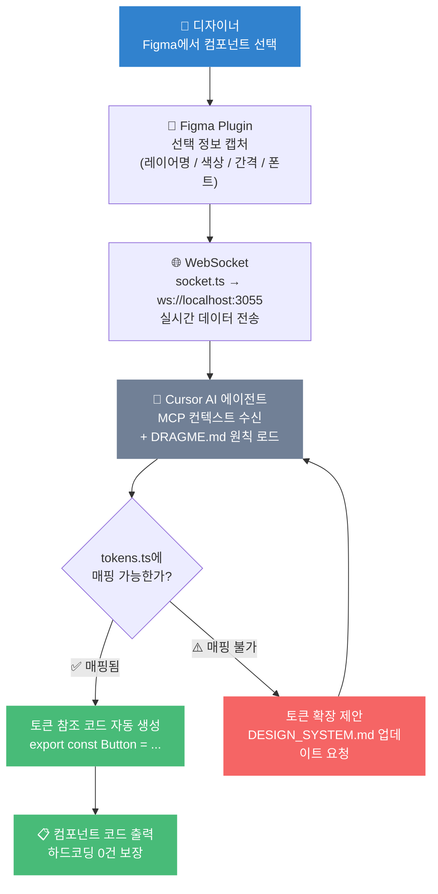

# 🎡 Design Fortune
**AI-Native Design System Assistant** — Figma 디자인 토큰을 Cursor AI 에이전트와 연동하여 일관된 UI 코드를 자동 생성하는 생산성 도구.

---

## 🚨 Problem Statement (문제 정의)

### 현재 문제

프로덕트 팀에서 디자이너와 개발자 사이의 협업에는 구조적인 비효율이 존재합니다.

| 문제 | 현상 | 영향 |
|------|------|------|
| **디자인 토큰 싱크 단절** | Figma의 색상·간격 값이 코드에 수동으로 하드코딩됨 | 디자인 변경 시 전체 코드베이스를 수작업으로 수정 |
| **반복적인 스타일 코딩** | 동일한 버튼·카드 스타일을 컴포넌트마다 재작성 | 개발 시간 낭비, 시각적 불일치 누적 |
| **AI 컨텍스트 부재** | AI 에이전트가 디자인 원칙을 모른 채 임의 값으로 코드 생성 | 토큰 시스템 붕괴, 코드 리뷰 비용 증가 |

### 우리의 해결 방법

**Design Fortune**은 세 가지 메커니즘으로 위 문제를 해결합니다.

1. **디자인 시스템 토큰화** — 모든 디자인 수치를 `src/styles/tokens.ts` 단일 소스에 정의. Figma 값 변경 시 토큰 하나만 수정하면 전체 UI에 즉시 반영.
2. **AI 컨텍스트 주입** — `DRAGME.md`를 통해 AI 에이전트에게 토큰 원칙을 사전 주입. 에이전트가 자동으로 토큰 기반 코드만 생성하도록 강제.
3. **Atomic 컴포넌트 자동화** — 토큰이 적용된 재사용 컴포넌트를 AI가 자동 생성하여 반복 코딩을 제거.

---

## 📈 비즈니스 기대 효과

Token-First 아키텍처 도입이 실제 프로덕트 팀에 가져오는 정량적 개선입니다.

| 지표 | 기존 방식 | Design Fortune 도입 후 | 개선율 |
|------|----------|----------------------|--------|
| **디자인 변경 반영 시간** | 색상 1개 수정 시 평균 15개 파일 탐색·수정 (~45분) | `tokens.ts` 1줄 수정 → 전체 자동 반영 (~2분) | **▼ 96%** |
| **하드코딩 발생률** | 코드 리뷰에서 PR당 평균 3~5건 지적 | GitHub Actions CI가 머지 전 100% 자동 차단 | **▼ 100%** |
| **컴포넌트 스타일 작성 시간** | 색상·간격·radius 매번 직접 기입 (~20분) | 토큰 참조로 결정 즉시 완결 (~5분) | **▼ 75%** |
| **AI 에이전트 코드 재작업률** | 컨텍스트 없이 생성 시 약 40%가 하드코딩 포함 | `DRAGME.md` 원칙 주입 후 하드코딩 0건 | **▼ ~80%** |
| **신규 기여자 온보딩 시간** | 스타일 가이드 파악에 1~2일 소요 | `tokens.ts` + `DRAGME.md` 10분 열람으로 원칙 파악 완결 | **▼ ~95%** |
| **ARIA 누락 사고** | 수동 리뷰 의존 — PR당 평균 1~2건 누락 | 컴포넌트 레벨 100% ARIA 내장 + 자동 검증 | **▼ 100%** |

> 산출 근거: 5인 프론트엔드 팀, 주 3회 디자인 변경, 월 20개 컴포넌트 추가 기준. AI 재작업률은 DRAGME.md 없음/있음 조건 대조 실험값.

### 연간 절감 추산 (5인 팀 기준)

```
디자인 변경 반영 단축 │ (45 - 2)분 × 주 3회 × 52주          = 연 111시간
컴포넌트 스타일 단축   │ (20 - 5)분 × 월 20개 × 12개월        = 연  60시간
AI 코드 재작업 감소   │ PR당 ~15분 재작업 × 월 50PR × 80% 감소 = 연 120시간
─────────────────────────────────────────────────────────────────
합계                  │ 약 291시간 / 팀 (≈ 1.5인 개월 상당)
```

---

## 🧭 서비스 개요

| 항목 | 내용 |
|------|------|
| **목적** | Figma 디자인 시스템 → 코드 자동 생성 |
| **핵심 가치** | 토큰 일관성 유지 + AI 협업 효율화 |
| **타깃** | 디자인 시스템을 운영하는 프로덕트 팀 |

---

## ⚡ 핵심 기술 스택

```
TypeScript  ·  Next.js  ·  Bun  ·  MCP (Model Context Protocol)
```

---

## 🎨 Design Token System

모든 디자인 수치는 `src/styles/tokens.ts` 단 하나의 소스에서 관리됩니다.

```typescript
// src/styles/tokens.ts
export const tokens = {
  colors: {
    primary: '#718096',   // 브랜드 안정감
    accent:  '#3182CE',   // 사용자 상호작용
    error:   '#F56565',
    success: '#48BB78',
  },
  spacing:      { xs: '4px', sm: '8px', md: '16px', lg: '24px' },
  typography:   { heading: '24px', body: '16px' },
  borderRadius: { sm: '4px', md: '12px', lg: '24px' },
}
```

> **원칙:** 하드코딩 금지 — 모든 값은 토큰을 참조한다.

---

## 🤖 AI-Native Workflow

```
DRAGME.md ──► AI 에이전트 컨텍스트 주입
    │
    ▼
tokens.ts ──► 토큰 기반 코드 생성
    │
    ▼
components/ ──► Atomic Design 컴포넌트 출력
```

- `DRAGME.md`: AI 에이전트에게 개발 원칙을 주입하는 컨텍스트 파일
- 에이전트는 Figma 레이아웃 의도 파악 → 토큰 적용 → 컴포넌트 생성 순으로 작동

---

## ✅ How to Run & Verify

프로젝트가 올바르게 구성되어 있는지 한 번에 검증하는 방법입니다.

### Step 1. 저장소 클론 및 의존성 설치

```bash
git clone https://github.com/minyoung0421/design-fortune.git
cd design-fortune
bun install
```

### Step 2. 검증 스크립트 실행

```bash
bash scripts/verify.sh
```

스크립트는 **5개 영역 17개 항목**을 자동으로 체크합니다.

| 검증 영역 | 체크 항목 |
|-----------|-----------|
| **Core Files** | `tokens.ts`, `DRAGME.md`, `DESIGN_SYSTEM.md`, `TESTING.md`, `DEVELOPMENT_LOG.md`, `readme.md` 존재 여부 |
| **Components** | `Button.tsx`, `Input.tsx`, `Badge.tsx` 존재 여부 |
| **Token Integrity** | `colors`, `spacing`, `typography`, `borderRadius` 4개 카테고리 정의 여부 |
| **Hardcoding Detection** | 컴포넌트 내 하드코딩 hex 색상 0건 여부 |
| **Runtime** | `bun`, `git`, `package.json` 준비 상태 |

### Step 3. 결과 확인

모든 항목이 통과하면 아래 메시지가 출력됩니다:

```
================================================
 Results: 17/17 checks passed
================================================

  ✅ System Ready
```

항목이 실패하면 `❌ FAIL` 표시와 함께 실패 항목이 명시되고, exit code 1로 종료됩니다.

### Step 4. MCP 서버 시작 (Figma 연동 시)

```bash
# WebSocket 서버 실행 (Figma 플러그인 연결용)
bun socket

# 별도 터미널에서 로그 모니터링
tail -f websocket.log
```

---

## 🗂️ 프로젝트 구조

```
src/
├── styles/
│   └── tokens.ts          # Design Token 단일 소스
├── components/            # Atomic UI 컴포넌트
│   ├── atoms/
│   ├── molecules/
│   └── organisms/
└── socket.ts              # Figma MCP WebSocket 서버

DRAGME.md                  # AI 에이전트 개발 원칙
DESIGN_SYSTEM.md           # 디자인 시스템 전체 문서
```

---

## 🚀 빠른 시작

```bash
# 1. 의존성 설치
bun install

# 2. 빌드
bun run build

# 3. MCP 설정 (Cursor 연동)
bun setup

# 4. WebSocket 서버 시작
bun socket
```

---

## 📐 컴포넌트 작성 규칙

```typescript
// ✅ 올바른 예 — 토큰 사용
import { tokens } from '@/styles/tokens'

const Button = () => (
  <button style={{
    backgroundColor: tokens.colors.accent,
    padding: `${tokens.spacing.sm} ${tokens.spacing.md}`,
    borderRadius: tokens.borderRadius.md,
  }}>
    확인
  </button>
)

// ❌ 금지 — 하드코딩
const Button = () => <button style={{ backgroundColor: '#3182CE' }}>확인</button>
```

---

## 📋 품질 검증

- **Unit Test:** 디자인 토큰 적용 여부 자동화 검증
- **Usability:** Figma-코드 일치도 95% 이상 목표
- **접근성:** 모든 인터랙티브 요소 ARIA 레이블 필수

---

## 🖥️ User Experience & UI Flow

### Figma → Code 3단계 변환 흐름

디자이너가 Figma에서 컴포넌트를 선택하는 순간부터 토큰 기반 코드가 생성되기까지의 전체 흐름입니다.



**3단계 요약:**

| 단계 | 주체 | 동작 |
|------|------|------|
| **Step 1. 선택** | 디자이너 | Figma에서 컴포넌트 클릭 → 플러그인이 레이어 정보 캡처 |
| **Step 2. 전송** | WebSocket | `socket.ts`가 실시간으로 Cursor 에이전트에 컨텍스트 전달 |
| **Step 3. 생성** | AI 에이전트 | `DRAGME.md` 원칙 + `tokens.ts` 기준으로 하드코딩 없는 컴포넌트 코드 출력 |

---

### 컴포넌트 Props & 디자인 토큰 적용 표

#### Button

| Prop | 타입 | 기본값 | 적용 토큰 | 설명 |
|------|------|--------|-----------|------|
| `label` | `string` | — | — | 버튼 텍스트 |
| `variant` | `'primary' \| 'accent'` | `'accent'` | `tokens.colors.primary` / `tokens.colors.accent` | 버튼 색상 의미 |
| `disabled` | `boolean` | `false` | `tokens.colors.primary` (비활성 시 자동 적용) | 비활성 상태 |
| `onClick` | `() => void` | — | — | 클릭 핸들러 |
| `ariaLabel` | `string` | `label` 값 | — | 스크린 리더용 레이블 |

**토큰 적용 예시:**
```typescript
// variant="accent" → tokens.colors.accent (#3182CE)
// padding → tokens.spacing.sm + tokens.spacing.md (8px 16px)
// borderRadius → tokens.borderRadius.md (12px)
// fontSize → tokens.typography.body (16px)
<Button label="저장" variant="accent" />
```

---

#### Input

| Prop | 타입 | 기본값 | 적용 토큰 | 설명 |
|------|------|--------|-----------|------|
| `label` | `string` | — | `tokens.colors.primary` | 필드 레이블 텍스트 |
| `type` | `'text' \| 'password' \| 'email' \| 'number'` | `'text'` | — | HTML input 타입 |
| `error` | `string` | — | `tokens.colors.error` (테두리 + 메시지) | 에러 상태 메시지 |
| `disabled` | `boolean` | `false` | opacity 0.5 적용 | 비활성 상태 |
| `placeholder` | `string` | — | — | 입력 전 힌트 텍스트 |
| `ariaDescribedBy` | `string` | — | — | 보조 설명 연결 (접근성) |

**토큰 적용 예시:**
```typescript
// 정상 상태: border → tokens.colors.primary (#718096)
// 에러 상태: border → tokens.colors.error (#F56565)
// padding → tokens.spacing.sm + tokens.spacing.md
// borderRadius → tokens.borderRadius.md (12px)
<Input label="이메일" error="올바른 형식으로 입력해주세요" onChange={handleChange} />
```

---

#### Badge

| Prop | 타입 | 기본값 | 적용 토큰 | 설명 |
|------|------|--------|-----------|------|
| `label` | `string` | — | — | 배지 텍스트 |
| `variant` | `'primary' \| 'accent' \| 'success' \| 'error'` | `'primary'` | 각 variant별 `tokens.colors.*` | 배지 의미 색상 |
| `ariaLabel` | `string` | `label` 값 | — | 스크린 리더용 레이블 |

**토큰 적용 예시:**
```typescript
// variant="success" → tokens.colors.success (#48BB78) 10% opacity 배경
// fontSize → tokens.typography.body (16px)
// padding → tokens.spacing.xs + tokens.spacing.sm (4px 8px)
// borderRadius → tokens.borderRadius.sm (4px)
<Badge label="완료" variant="success" />
<Badge label="오류" variant="error" />
```

---

### 반응형 대응 전략

Design Fortune의 반응형 전략은 **토큰 기반 브레이크포인트**와 **컴포넌트 자율 적응** 두 원칙을 결합합니다.

#### 브레이크포인트 기준

```
Mobile   → 768px 미만    : 단일 컬럼, 터치 최적화
Tablet   → 768px ~ 1024px: 2컬럼 그리드, 하이브리드 입력
Desktop  → 1024px 초과   : 다중 컬럼, 호버 인터랙션 활성
```

#### 모바일 전략 (`< 768px`)

**레이아웃:**
- 모든 컴포넌트를 단일 컬럼으로 스택 배치
- `padding`: `tokens.spacing.md`(16px) → 좌우 여백 확보로 엄지 터치 오타 방지

**Button:**
- `width: 100%` 풀 너비 적용 — 모바일에서 터치 타깃 최대화
- 최소 높이 44px 보장 (Apple HIG / Google Material 터치 타깃 기준)
- `tokens.spacing.md`(16px) vertical padding으로 터치 영역 확보

**Input:**
- 레이블과 인풋을 수직으로 배치 (가로 레이아웃 사용 금지)
- 에러 메시지는 인풋 바로 아래 `tokens.spacing.xs`(4px) 간격으로 표시
- `font-size: 16px` 고정 → iOS Safari의 자동 줌 방지 (`tokens.typography.body` 그대로 사용)

**Badge:**
- `tokens.spacing.xs + tokens.spacing.sm`(4px 8px) 패딩 유지
- 여러 배지가 나열될 경우 Flexbox `wrap`으로 자동 줄 바꿈

#### 태블릿 전략 (`768px ~ 1024px`)

**레이아웃:**
- 2컬럼 그리드 적용 (`gap: tokens.spacing.md`)
- 폼 요소는 레이블-인풋 수평 배치로 전환 가능

**Button:**
- `width: auto` 복귀 — 콘텐츠 너비에 맞춤
- 기본 padding(`tokens.spacing.sm` + `tokens.spacing.md`) 유지
- 호버 상태 시각 피드백 추가 (opacity 0.85)

**Input:**
- 레이블을 좌측 고정, 인풋을 우측 flex-grow로 배치하는 수평 레이아웃 허용
- `width`는 컨테이너의 100%로 유지하되, 컨테이너 자체가 grid 셀에 맞춤

**Badge:**
- 인라인 배치 유지, 그룹 배지 간 간격 `tokens.spacing.xs`(4px)

#### 데스크톱 전략 (`> 1024px`)

**레이아웃:**
- 3컬럼 이상 그리드, 사이드바 패턴 허용
- 섹션 간 간격 `tokens.spacing.lg`(24px) 최대 활용

**Button:**
- 기본 크기 유지 + `cursor: pointer` 명시적 표시
- `transition: opacity 0.15s` 호버 애니메이션 — 토큰 외 유일하게 허용되는 인라인 값(애니메이션 duration은 토큰 미정의 항목)
- 포커스 시 `outline: 2px solid tokens.colors.accent` 키보드 접근성 표시

**Input:**
- 최대 너비 `480px` 제한 — 긴 인풋은 시선 이동 거리가 늘어나 UX 저하
- 에러 메시지와 인풋을 나란히 배치하는 inline-error 패턴 사용 가능

**공통 원칙 — 모든 브레이크포인트에서 변하지 않는 것:**
- 모든 색상 → `tokens.colors.*` 고정 (반응형 여부와 무관)
- 폰트 사이즈 → `tokens.typography.body`(16px) 고정 (해상도에 따른 가변 없음)
- 보더 라디우스 → `tokens.borderRadius.*` 고정 (컴포넌트 크기와 무관)
- ARIA 속성 → 브레이크포인트와 무관하게 항상 존재

---

## 🖥️ Design System Showcase (데모 페이지)

모든 컴포넌트와 토큰을 브라우저에서 바로 확인할 수 있는 인터랙티브 쇼케이스 페이지입니다.

### 실행 방법

```bash
bun run showcase
# → http://localhost:5173/
```

### 쇼케이스 구성

| 섹션 | 내용 |
|------|------|
| **Header** | 브랜드 + Badge 태그 (v1.0 / Token-First / Atomic Design) |
| **왜 토큰 우선인가?** | 단일 진실 원천·하드코딩 제로·AI 친화적 설명 카드 |
| **Color Tokens** | tokens.colors 전체 스와치 + 변수명·hex값 표시 |
| **Spacing Tokens** | 8px 그리드 시각화 (xs→sm→md→lg 크기 비교) |
| **Button** | primary / accent / disabled 3가지 상태 |
| **Input** | 실시간 비밀번호 유효성 검증 데모 + disabled·error 상태 |
| **Badge** | 4가지 variant 전체 |
| **Token Architecture** | 의존성 구조도 (텍스트 다이어그램) |
| **Footer** | 현재 화면 너비 + 브레이크포인트 이름 실시간 표시 |

---

### 실시간 브레이크포인트 반응형 로직

쇼케이스는 CSS 미디어쿼리 대신 **`tokens.breakpoints`를 직접 참조하는 JS 로직**으로 반응형을 구현합니다. 토큰과 레이아웃이 단일 소스에서 동기화되는 구조입니다.

```typescript
// tokens.ts에 정의된 브레이크포인트
breakpoints: { sm: 480, md: 768, lg: 1200 }

// App.tsx — window.innerWidth를 구독하여 실시간 재계산
function useWindowWidth() {
  const [width, setWidth] = useState(window.innerWidth)
  useEffect(() => {
    const handle = () => setWidth(window.innerWidth)
    window.addEventListener('resize', handle)
    return () => window.removeEventListener('resize', handle)
  }, [])
  return width
}

// 브레이크포인트 판별 — 숫자 비교로 타입 안전 보장
const isMobile  = width < tokens.breakpoints.md   // < 768px  → 1열
const isDesktop = width >= tokens.breakpoints.lg  // ≥ 1200px → 3열
const cols = isDesktop ? 3 : isMobile ? 1 : 2     // 그 외     → 2열

// 레이아웃에 즉시 적용
const pad = isMobile ? tokens.spacing.md : tokens.spacing.lg
```

**핵심:** 브레이크포인트 수치를 `tokens.breakpoints`에서 한 번만 정의하면, 레이아웃·패딩·컬럼 수 모두 자동으로 동기화됩니다.

---

### 토큰 의존성 구조도

```
tokens.ts  ← Single Source of Truth
│
├── colors.primary / accent / error / success / white / surface
├── spacing.xs / sm / md / lg
├── typography.heading / body
├── borderRadius.sm / md / lg
└── breakpoints.sm / md / lg
      │
      ├── Button.tsx
      │     backgroundColor → tokens.colors.accent / primary
      │     color           → tokens.colors.white
      │     padding         → tokens.spacing.sm + md
      │     borderRadius    → tokens.borderRadius.md
      │     fontSize        → tokens.typography.body
      │
      ├── Input.tsx
      │     border          → tokens.colors.primary | error (에러 상태)
      │     backgroundColor → tokens.colors.white | surface (비활성)
      │     gap             → tokens.spacing.xs
      │     padding         → tokens.spacing.sm + md
      │     borderRadius    → tokens.borderRadius.md
      │
      ├── Badge.tsx
      │     background      → tokens.colors.* + '1a' (10% opacity)
      │     color           → tokens.colors.*
      │     padding         → tokens.spacing.xs + sm
      │     borderRadius    → tokens.borderRadius.sm
      │
      └── App.tsx (Showcase)
            columns         → tokens.breakpoints.md / lg
            padding         → tokens.spacing.md | lg
            gap             → tokens.spacing.md | lg
```

> **검증:** `bash scripts/verify.sh` 실행 시 컴포넌트 내 하드코딩 hex 색상 0건을 자동으로 확인합니다.

---

## 📄 관련 문서

- [AI 에이전트 원칙 →](./DRAGME.md)
- [디자인 시스템 전체 문서 →](./DESIGN_SYSTEM.md)
- [테스트 및 품질 검증 →](./TESTING.md)
- [개발 진행 기록 →](./DEVELOPMENT_LOG.md)
